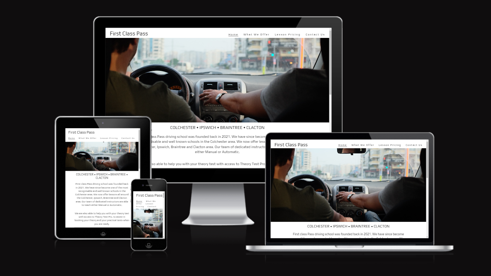
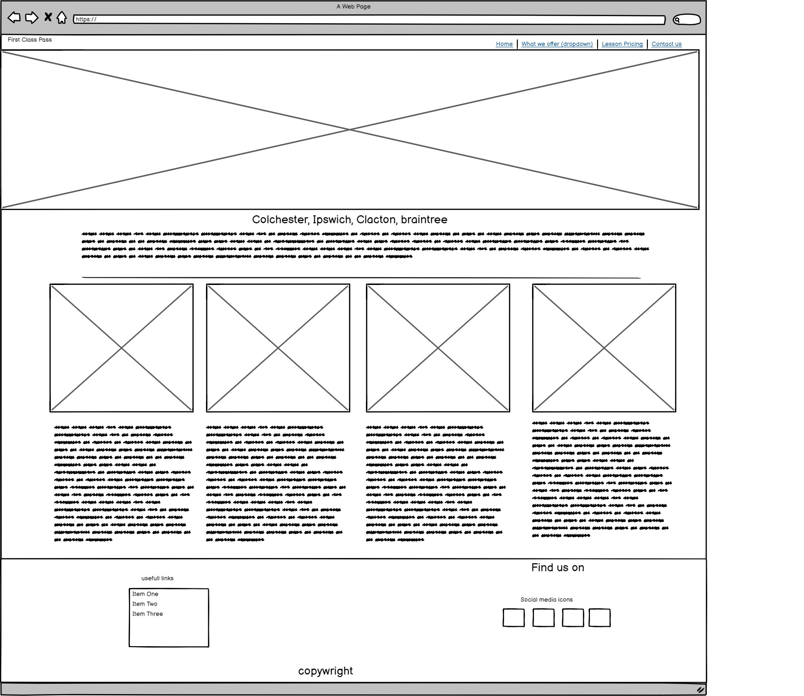
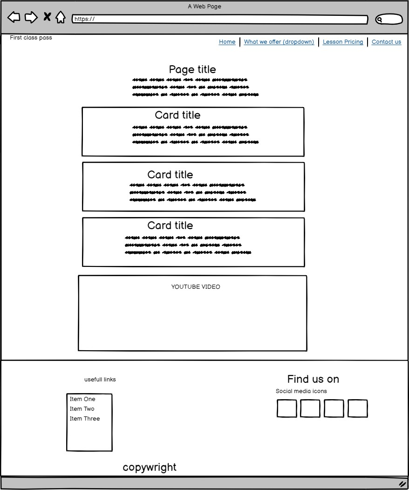
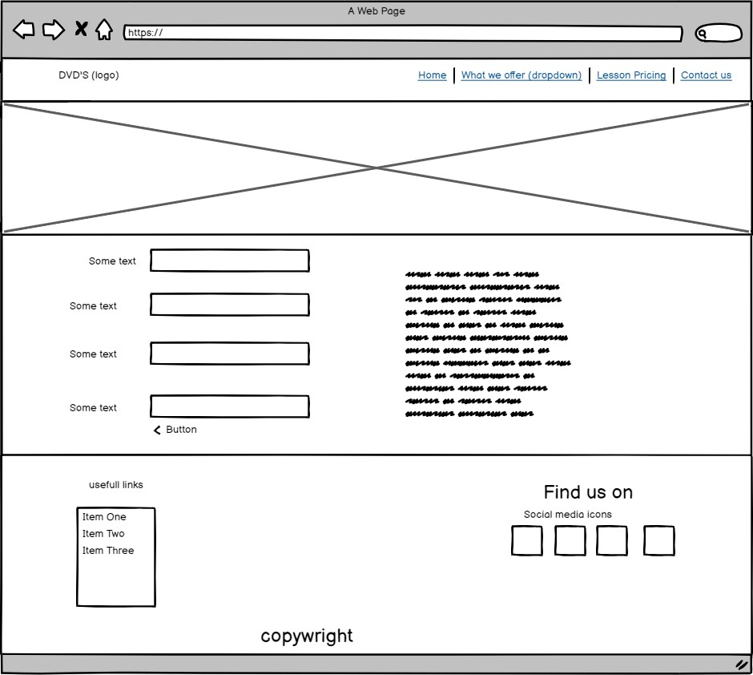
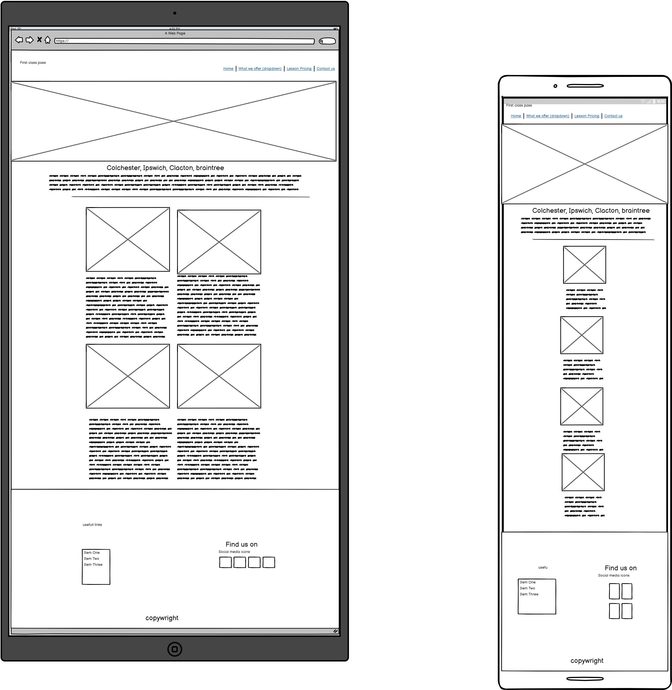
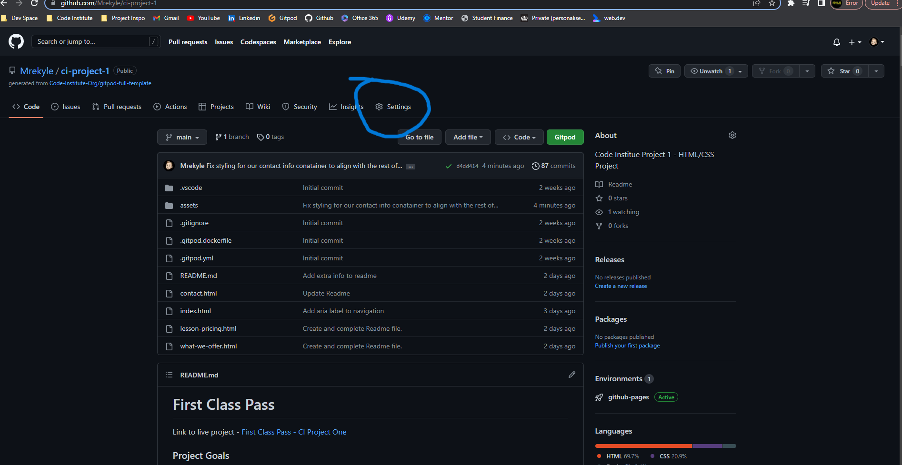
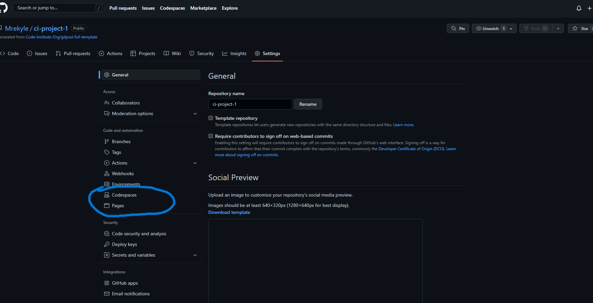
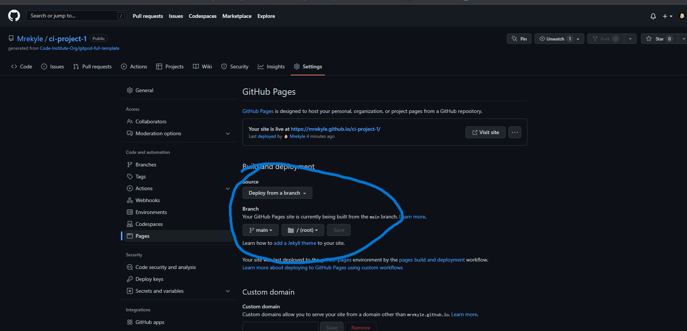

# First Class Pass

Link to live project - [First Class Pass - CI Project One](https://mrekyle.github.io/ci-project-1//)

### Project Goals

First Class Pass is an imagined driving school serving Colchester and the surrounding areas. With the intention of the website to showcase what they do, to intice a potential student to sign on and to generate more buisness through the content on the website. Either with gaining new students or inticing potential new instructors to work for them through the training program or to intine qualified instructors to come work for them.

### Target Audiance

The initial target audiance for the project is young drivers aged between 16 to 18. With them researching a potential driving school to go with or to make a switch from another for various reasons. Although the intended audiance is new drivers, it is aso targeting parents of young drivers who wish to gift lessons for a birthday, people who need a refresher lesson, students who want an intensive course. As well as potential people who want to become a drving instructor them self. 

## Wireframes

### Initial Home Page Concept

### Initial Basic Page Layout

### Initial Contact form layout

### Initial Mobile and Ipad design concept

### Table of contents 
1. Features
    - Implemented
    - Future
2. Pages
    - Home Page
    - What We Offer Page
    - Lesson Pricing Page
    - Contact Us Page
3. Technology used
4. Testing
    - CSS
    - HTML
    - Lighthouse
5. Bugs
6. Deployment
7. Sources
    - Code
    - Fonts
    - Images

## Features

The current features that are used throughout the website.

### Navigation

The navigation has a simple layout that focuses on a simple design that it intuative for the user to be able to look and find the information that they are looking for.

- Featuring the page title, which links back to the home page when clicked.
- Including a home page, what we offer page, lesson pricing and a contact us page link.
- Choosing a simple black and white color scheme to make the navigation bar easy to read and use.
- Included a visual que that shows what page you are on in the navigation bar itself. Including a visual que whan hovering over a page title.

### Hero Image

- A background image that is appropriate to the web page's initial intention and gives an immediate visual que to what the intention of the website is for.
- This image was chosen to give a first impresson that stands out and would stick in the users mind

### Recent Reviews 

- The recent reviews container includes an image and a breif review of the intended real world customer. Showcasing the drivings schools success.
- This was added to showcase what other students think of the driving school. To intice new students to join

### Footer

- In the footer the usefull links to students and future students are included.
- Also included is links to the schools social media pages where they can find more content relating to the school.

### Lesson Cards 

- Lesson cards display a breif overview of what the school offers.
- The intention is to tell the potential student what could happen during the lesson
- It also displays the different types of lessons that are offered by the driving school

### Video 

- An embedded youtube video giving a brief lesson on how to drive a car. This was implemented with the intention of giving potential students an idea of what is to come. 

### Lesson Pricing Cards 

- Lesson pricing cards are used to display the price of the lesson itself 
- A brief peice of information about what the lesson entails

### Contact Form 

- The contact form was implemented to give the user of the site an easy way of contacting the school for potential lessons. Instead of having to go away to a seperate email application or call
- It allows the driving school to collect all information required from the student to speed up the process of getting them on the road

## Future Features

Futures features of the website are to include
- An online booking system with calander intergration - including personal preferences to best match the student to the driver
- A driver profile system - Allowing the teacher to know where to go to pick up the student, preferences such as pronouns etc..
- A progress/lesson tracker - once a certain skill has been mastered, the student and teacher will know whats coming next.

## Pages 

In total there are four pages to the website at its current state. 

- Home page
- What we offer Page 
- Lesson Pricing page 
- Contact us page

With future pages planned

- 404 error page
- Contact form submitted page
- Student area - for future features mentioned above
- Teacher area - for future features mentioned above.

## Technology Used

During the development of the website HMTL, CSS, Github and Gitpod were the main technologies that were used to build, develop and deploy the website.

- HTML - Used to build the basic blocks and structure of the website
- CSS - Used to add styling to the website to give it an appealing look to the user
- Github - Used for version control, allowing the progress of the project to stay on track and progress
- Gitpod - Used as a virtual development space, allowing development anywhere anytime
- Github Pages - Used to deploy the project as a live website for all to see and use

## Site Testing

Over the period of development the website went under multiple different periods of testing to get the right look, fit and feel for the intended user. 

Once development had finished the website was put through W3C html Validator, Jigsaw CSS validator and Lighthouse Performance Validator on google chrome. 

During the course of the development of the website I also performed manual testing myself such as

- Checking the responsive design on different devices
- Checking all the navigation links work
- Checking all the external links go to where they say they go. Ensuring they open in a seperate tab
- Ensuring all images have an 'alt' or 'title' attribute incase of error
- Ensuring the video links correctly on multiple different devices.
- Ensuring the contact form goes to the correct place (Love running form dump)
- Ensuring the contact form doesnt let the user submit without filling out the required and correct intended information

### CSS

- CSS fail

- CSS pas

### HTML

- HTML fail

- HTML pass

### Lighthouse

- Lighthouse desktop performance

- Lighthourse mobile Performance

The performance is low on the mobile version due to a browser extension that is installed on google chrome. Further inspection also shows towards slow loading time for the images due to their varying sizes and different file sizes.

## Bugs

During the development process of the project there were a few bugs. Most of which were a small syntax error.

- images not displaying due to an extra '/' resulting in a broken file path.
- favicon not displaying due to a broken file path
- contact form text input area had placeholder displaying in center of the area. Fixed by changing out the input to 'textarea'
- In the footer the copywrite information was displaying under flex box rules. Meaning it wasnt aligning how intended. Fixed by removing from the flex item and addded into its own 'div' element.
- Footer showing white bar underneath as not enough content to fill the page - Fixed by turning into a flex element forcing it to the bottom of the page.

## Deployment

Deployment of the project was done by using Github Pages.

- Step one is to load up the repo on the github website and click on the settings pannel

- Step two is to go to the click on the pages panel on the left hand side

- Step three is to select to deploy the page from the main folder ensuring that the root folder folder is also selected

Link to live project - [First Class Pass - CI Project One](https://mrekyle.github.io/ci-project-1//)

## Sources

During the project external items such as images and fonts were needed to add an extra layer of design to the project. 

### Code

No such code has been coppied and pasted into the project, all has been typed out. Although insipiration for some styling was taken from the Love Running Project.

Stackoverflow was also used as a reference to help me fix ay minor issues that came up during the development of the project.

### Fonts 

Fonts used
- Lato [Lato font](https://fonts.google.com/?query=lato)
- Oswald [Oswald Font](https://fonts.google.com/specimen/Oswald?query=oswald)
- Play [Play font](https://fonts.google.com/specimen/Play?query=play)

Font awesome icons were also used in parts of the project.

Font Awesome [A link to the Font Awesome library](https://fontawesome.com/)
### Images

Images used in the project are from 
- Pexels
- Shutterstock
- Unsplash

Pexels [A link to Pexels - Royalty free images](https://www.pexels.com/)

Shutterstock [A link to Shutterstock - Royalty free images](https://www.shutterstock.com/search/passed-driving-test)

Unsplash [A link to Unsplash - Royalty free images]( https://unsplash.com/photos/_c7haaSAcIg)

### Video

The video that was used in the project (How to drive) is from youtube. The origional owner of the content is a user called Conquer Driving.

Youtube Video [The youtube video used in the project](https://www.youtube.com/watch?v=VIVaqt4VhKc&ab_channel=ConquerDriving)